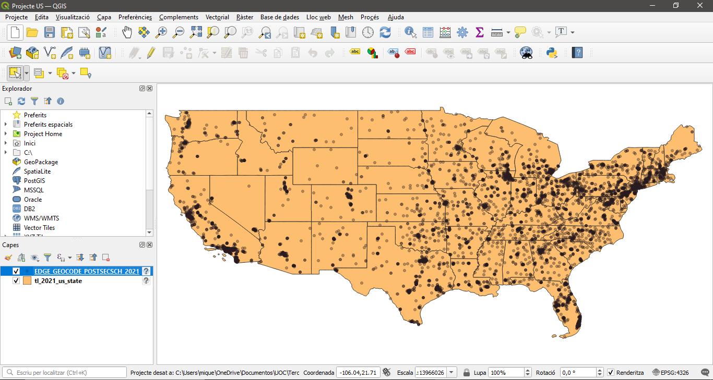
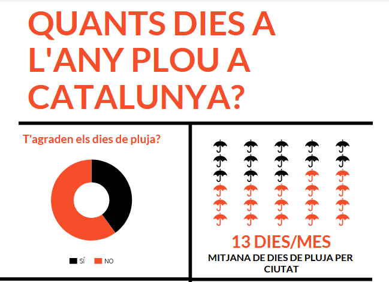
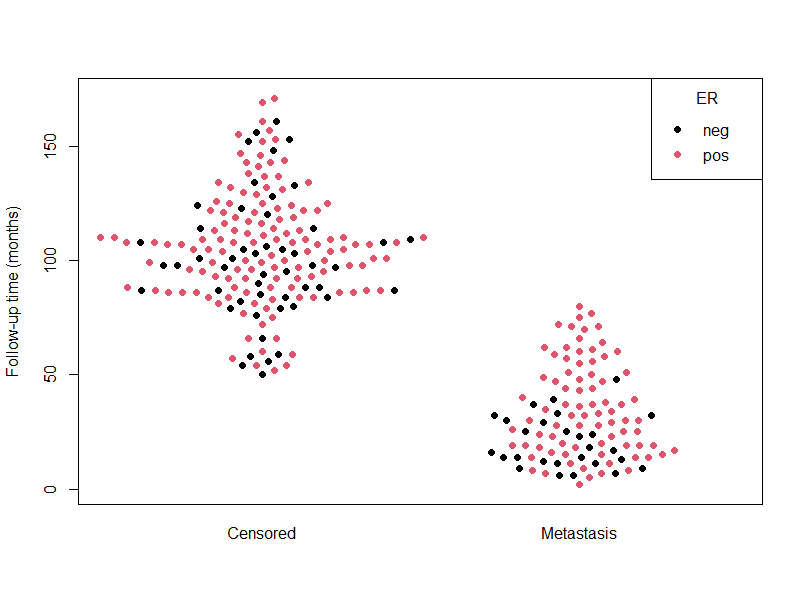

## Visualització de dades - PAC 2

A continuació es presenten les visualitzacions de la PAC 2 de l'assignatura de visualització de dades.

### Dot Density Map

Representació feta amb QGIS, en la qual es representen els centres escolars de secundària al territori continental d’Estats Units (llevat d’Alaska). A continuació es mostra la seva edició amb QGIS.



El resultat obtingut és el següent:


### Icon Chart

A l'Icon Chart s’ha representat una enquesta i unes estadístiques sobre els dies de pluja a Catalunya.



### Beeswarm Plot

S'ha utilitzat el Breast Cancer Dataset per representar el temps de supervivència en funció de l’outcome del pacient mitjançant el següent script en R:

```
data(breast)
beeswarm(time_survival ~ event_survival, data = breast,
         method = 'swarm',
         pch = 16, pwcol = as.numeric(ER),
         xlab = '', ylab = 'Follow-up time (months)',
         labels = c('Censored', 'Metastasis'))
legend('topright', legend = levels(breast$ER),
       title = 'ER', pch = 16, col = 1:2)
```

El resultat és el següent:


